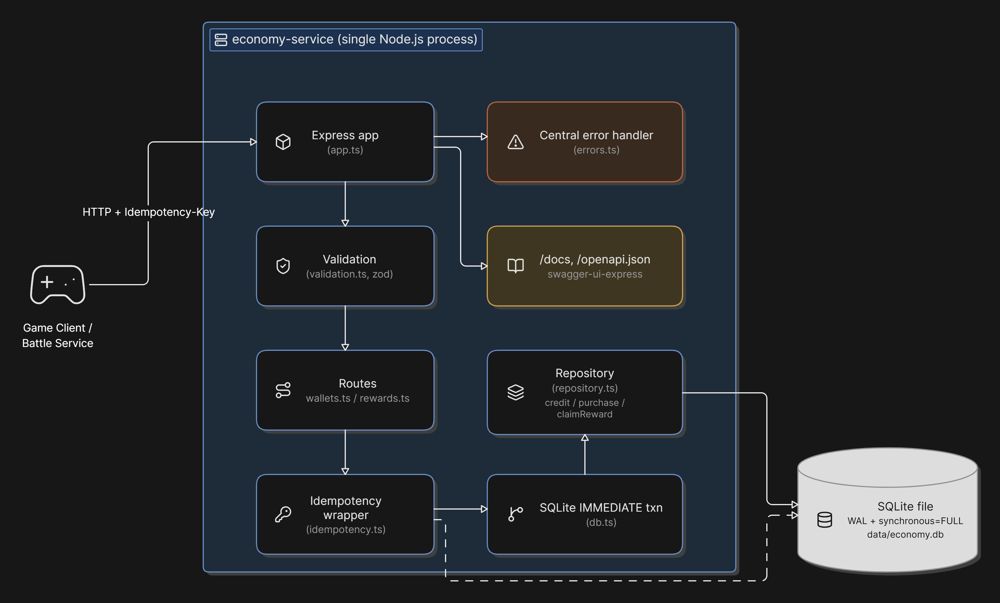
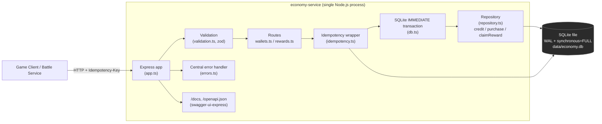
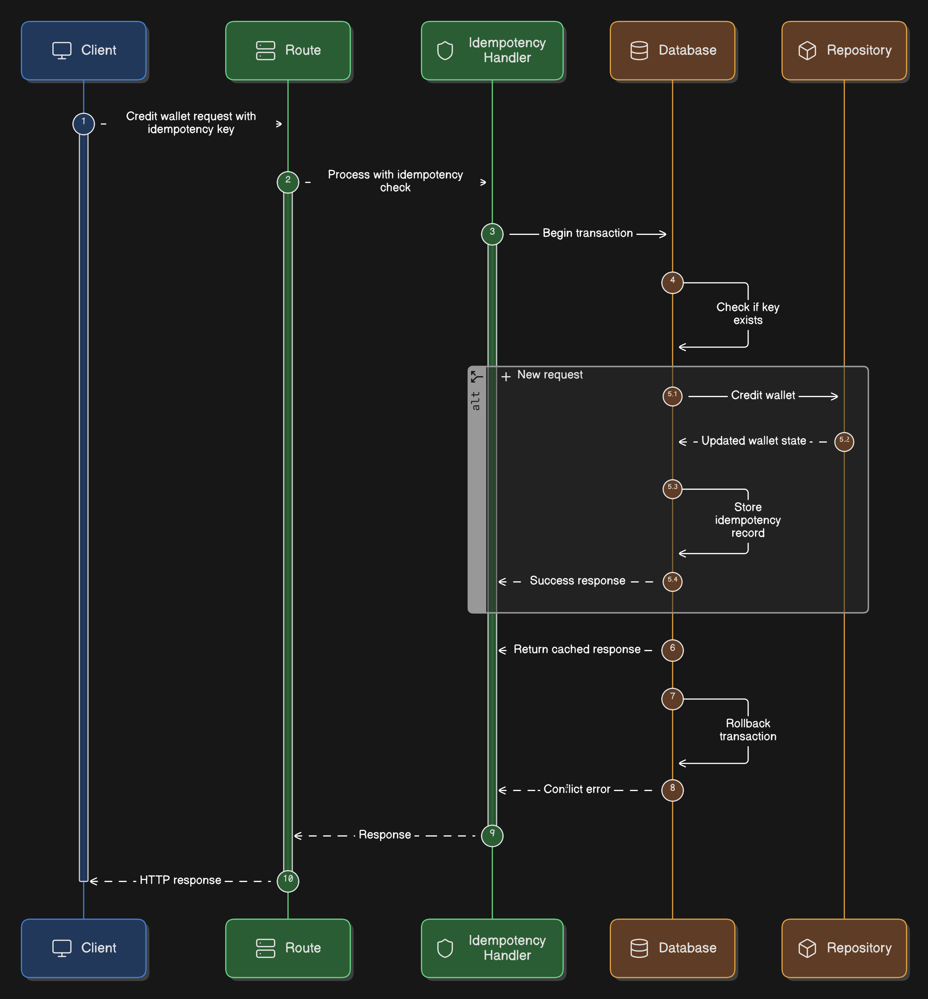
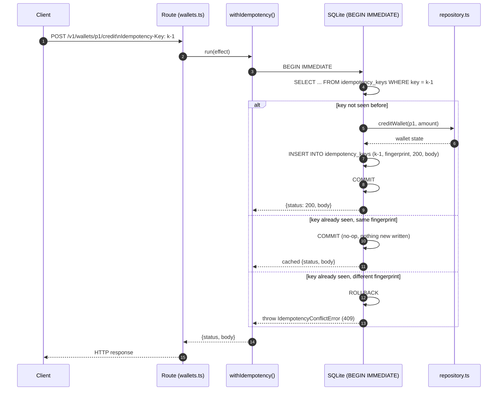
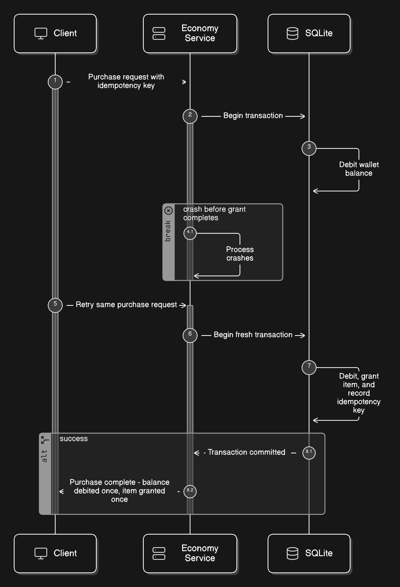
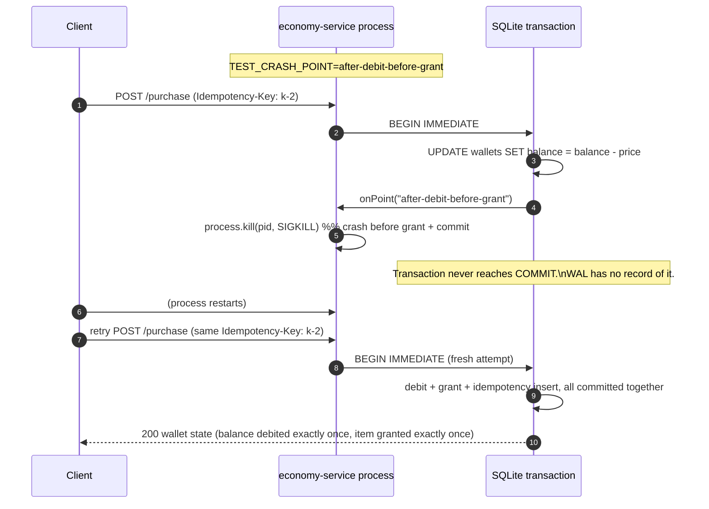
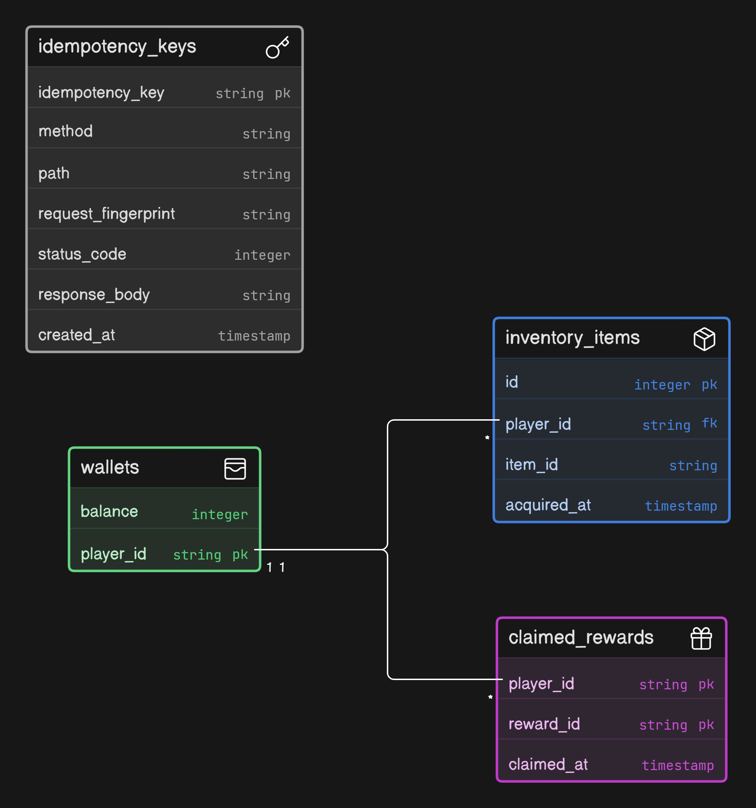
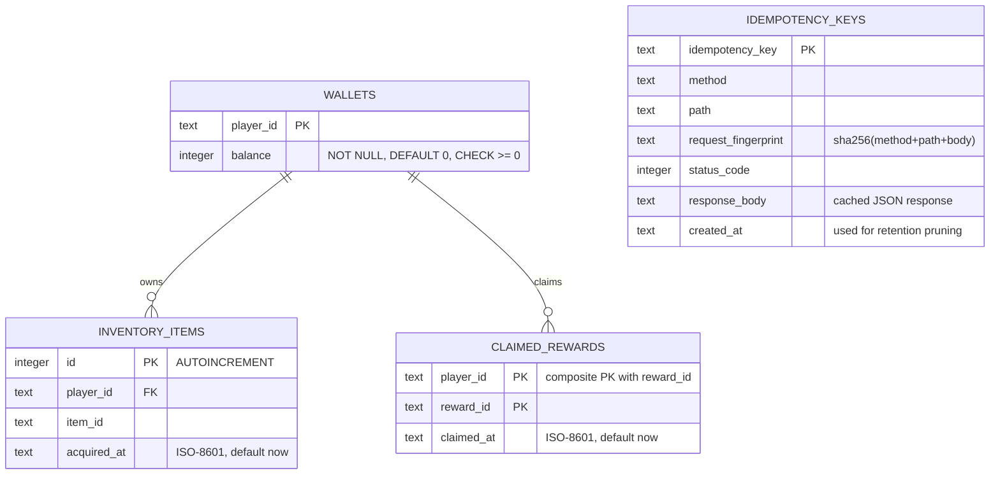
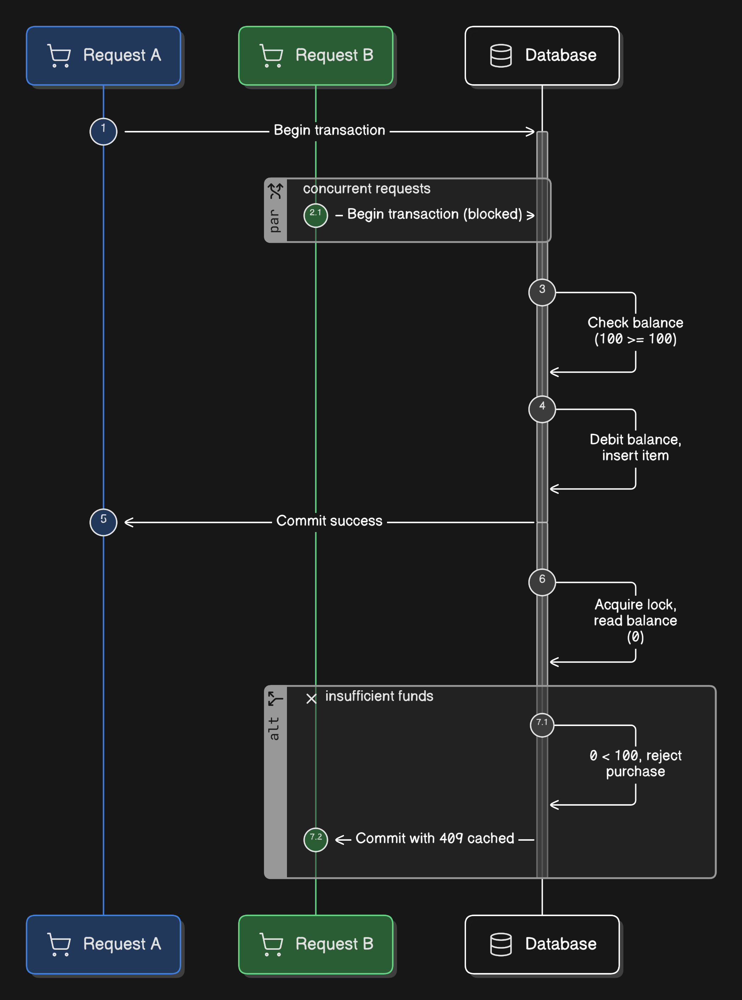
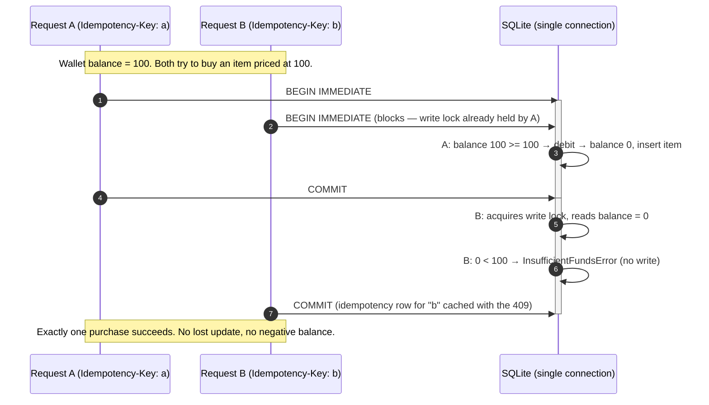

# DESIGN.md — Economy Service

## 1. Overview

The economy service is a small HTTP API that owns a player's **balance**, **inventory**, and **one-time reward claims**. It exposes three mutating endpoints (`credit`, `purchase`, `claim`) and one read endpoint (`GET /v1/wallets/:playerId`). The service is the single source of truth for money and items — clients never assert their own balance.

Every mutating request must carry an `Idempotency-Key` header. Retrying the same request with the same key is guaranteed to produce exactly one effect and the same response, even across a crash.

The service ships with a `Dockerfile` and `docker-compose.yml` (see `README.md` → "Running with Docker"). The SQLite file is written to a Docker volume rather than the container's writable layer, so the same crash-durability story holds when the *container* is killed/restarted, not just the bare process.

## 2. Architecture

Everything runs as **one Node.js process with one SQLite connection**. That single connection plus Node's single-threaded event loop is what makes the concurrency story simple: there is no connection pool where two requests could each grab a separate connection and race each other outside of SQLite's own locking.

Layers, inside out:

- **`db.ts`** — opens the SQLite file, sets pragmas (`WAL`, `synchronous=FULL`, `foreign_keys=ON`), owns the schema, and exposes `runInTransaction`, which wraps a function in `BEGIN IMMEDIATE … COMMIT/ROLLBACK`.
- **`repository.ts`** — pure business operations (`creditWallet`, `purchase`, `claimReward`, `readWalletState`). These assume they are already running inside a transaction; they don't manage transactions themselves.
- **`idempotency.ts`** — wraps a repository call so that the **idempotency-key check, the business effect, and the idempotency-key write all happen in the same transaction**. This is the core correctness mechanism (see §4).
- **`routes/*.ts`** — HTTP-shape only: parse params/body with `validation.ts`, call the idempotency wrapper, translate the result to a status code + JSON body.
- **`errors.ts`** — typed `AppError` subclasses (`ValidationError`, `InsufficientFundsError`, `IdempotencyConflictError`, `IdempotencyKeyMissingError`) each carrying their own HTTP status/code, caught centrally in `app.ts` so no internal error ever leaks to a client.

## 3. Datastore choice and why

**Choice:** SQLite, via Node's built-in `node:sqlite` module (`DatabaseSync`), as a single file on disk (`data/economy.db`).

**Why:** The task's hard requirement is a *single-writer, crash-durable ledger* — not high write concurrency across many machines. For that shape, an embedded, single-file, ACID datastore is the simplest thing that is still correct:

- It needs no separate server process or container to be "genuinely durable" — durability is a property of the file and the pragmas below, which is easy to reason about and easy to grade.
- A single connection in a single-threaded process means SQLite's own locking is the *only* concurrency primitive in play. There is no pool, no second process, no distributed lock to get wrong.
- Two pragmas do the durability work:
  - `PRAGMA journal_mode = WAL` — writes go to a write-ahead log first; a committed transaction is recorded there before it's checkpointed into the main file. This is what lets a `kill -9`'d-and-restarted process see every committed write and nothing else.
  - `PRAGMA synchronous = FULL` — forces an `fsync` on every commit. `NORMAL` would be faster but can still lose the most recent commits on a full power loss (it only guarantees consistency across an *application* crash). Since the assessment explicitly prioritizes durability over throughput, we pay the `fsync` cost.

**Trade-off accepted:** SQLite does not scale to multiple writer processes/machines. If the service needed to run more than one instance against the same data, this choice would need to change (e.g. Postgres with `SELECT … FOR UPDATE` or serializable transactions). For a single-process wallet service, that trade-off is the right one — see §7 for how this would evolve.

## 4. Non-duplicate (idempotency) strategy

Every mutating route requires a client-supplied `Idempotency-Key` header (missing key → `400 idempotency_key_required`).

`withIdempotency()` (`idempotency.ts`) does the following, **all inside one `BEGIN IMMEDIATE` transaction**:

1. Look up `idempotency_key` in the `idempotency_keys` table.
2. If found and the **request fingerprint** (`sha256(method + path + body)`) matches → return the **cached** `status_code` / `response_body` without re-running any business logic.
3. If found but the fingerprint differs → `409 idempotency_key_reused` (same key reused for a different request — this is a client bug, so it's rejected, not merged).
4. If not found → run the business effect. If it throws a known `AppError` (e.g. insufficient funds), that rejection is cached *as if it were a success* — retries of a rejected request must keep seeing the same rejection, not a different answer because the world changed in between. If it throws an *unknown* error, the whole transaction (including the idempotency-key insert) rolls back, so the key is **not** poisoned and stays retryable once the underlying issue is fixed.
5. Insert the idempotency row and commit.

**Retention:** idempotency rows are kept for `IDEMPOTENCY_KEY_RETENTION_MS = 7 days` (`db.ts`). Rows older than that are pruned opportunistically on process startup via `pruneExpiredIdempotencyKeys()` — no separate cron/scheduler process is needed for a service this size. Seven days comfortably covers realistic client retry windows (network blips, client restarts, mobile app resumes) while keeping the table bounded for a long-running deployment.

## 5. Atomicity & durability strategy

- **Atomic unit:** one HTTP request = one SQLite transaction (`BEGIN IMMEDIATE … COMMIT`). The idempotency-key record and the business effect (balance update, inventory insert, reward insert) are written in that *same* transaction — there is no window where one is durable and the other is not.
- **Isolation level:** `BEGIN IMMEDIATE` acquires SQLite's write lock at the *start* of the transaction, not lazily on first write. This closes the classic "read balance, then two requests both decide they can afford it, then both write" race: the second request's `BEGIN IMMEDIATE` simply blocks until the first request's transaction commits or rolls back, so the two purchases against the same wallet are fully serialized rather than interleaved. Combined with a single `DatabaseSync` connection and Node's single JS thread, there is exactly one transaction touching the database at any instant.
- **What "all-or-nothing" means for `purchase` specifically:** `repository.ts#purchase` reads the balance, checks it can cover `price`, debits, inserts the inventory row — all inside the same transaction. If the process is killed (`kill -9`) at *any* point before `COMMIT` — including the deliberate `after-debit-before-grant` test hook — SQLite's WAL simply never records that transaction. On restart, it is as if the request never happened: the balance is whatever it was before, no item was granted, and a retry with the same `Idempotency-Key` runs the purchase fresh. There is no state where a debit is recorded without its matching grant.
- **Insufficient funds:** checked before any write. If the balance can't cover `price`, `InsufficientFundsError` is thrown immediately and *no row is touched* — the rejection is still cached by the idempotency wrapper so a retry gets the same clean `409`.
- **Claim-once as a data invariant, not just an idempotency-key trick:** `claimed_rewards` has a `(player_id, reward_id)` primary key. Even if a client used a *different* `Idempotency-Key` for a second claim of the same reward, the second insert would violate the primary key — the code checks for this explicitly and returns `alreadyClaimed: true` instead of erroring, because "grant a reward once per player" is a business rule independent of any single request's idempotency key.
- **Simulated crash test:** setting `TEST_CRASH_POINT=after-debit-before-grant` makes the server `SIGKILL` itself the instant a purchase transaction has executed the debit statement but not yet the grant insert (see `index.ts`, `repository.ts`). This lets a test deterministically land "the middle of a purchase" instead of relying on timing luck, and then assert on restart that either both the debit and grant exist, or neither does.

## 6. Data model

Notes:

- `inventory_items.player_id` is not declared as a SQL foreign key (SQLite's dynamic typing plus `INSERT OR IGNORE`-based wallet creation makes it simpler not to), but every write path goes through `getOrCreateWallet()` first, so a wallet row always exists before any inventory or reward row references it.
- Balance can never go negative: enforced both at the schema level (`CHECK (balance >= 0)`) and at the application level (`purchase()` checks `wallet.balance < price` before writing).
- There is deliberately **no separate "ledger of transactions" table** — the wallet balance is a running total, and history is reconstructable from `idempotency_keys` (recent requests) rather than a permanent double-entry ledger. For a real production economy this would likely grow into an append-only ledger with the balance as a materialized view; out of scope for this exercise but noted as a natural next step.

## 7. API contract

Base path: `/v1`. All mutating endpoints require header `Idempotency-Key: <opaque client-generated string, ≤ 200 chars>`.

| Method & path | Body | Success | Documented failures |
|---|---|---|---|
| `GET /v1/wallets/:playerId` | — | `200 { balance, inventory[], claimedRewards[] }` | `400 validation_error` (bad `playerId`) |
| `POST /v1/wallets/:playerId/credit` | `{ amount: int > 0, reason: string }` | `200` wallet state | `400 validation_error`, `400 idempotency_key_required`, `409 idempotency_key_reused` |
| `POST /v1/wallets/:playerId/purchase` | `{ itemId: string, price: int > 0 }` | `200` wallet state | `409 insufficient_funds` (`{ balance, price }` in `details`), `400 validation_error`, `400 idempotency_key_required`, `409 idempotency_key_reused` |
| `POST /v1/rewards/:rewardId/claim` | `{ playerId: string }` | `200 { ...wallet, rewardId, alreadyClaimed }` | `400 validation_error`, `400 idempotency_key_required`, `409 idempotency_key_reused` |
| `GET /healthz` | — | `200 { status: "ok" }` | — |
| `GET /docs`, `GET /openapi.json` | — | Swagger UI / raw spec | — |

Error body shape (all errors): `{ "error": "<machine_code>", "message": "<human message>", "details"?: {...} }`.

**Units & limits** (`validation.ts`): `amount`/`price` are positive integers in minor currency units, capped at `1_000_000_000`. `playerId` / `itemId` / `rewardId` match `^[A-Za-z0-9_-]{1,128}$`. `reason` ≤ 200 chars. `Idempotency-Key` ≤ 200 chars. Request bodies are capped at 32 KB by `express.json({ limit: "32kb" })`, and malformed JSON is normalized to `400 bad_request` rather than crashing the process.

## 8. Sequence: purchase under concurrent requests on the same wallet

## 9. Out of scope (by design, per the assessment brief)

- Player accounts/auth, matchmaking, and the battle game itself — `credit` simulates a payout only.
- Multi-process/multi-machine horizontal scaling of the datastore (see §3 and `RESILIENCE.md` §2 for how this would be approached).
- A permanent double-entry ledger (see §6 note).
