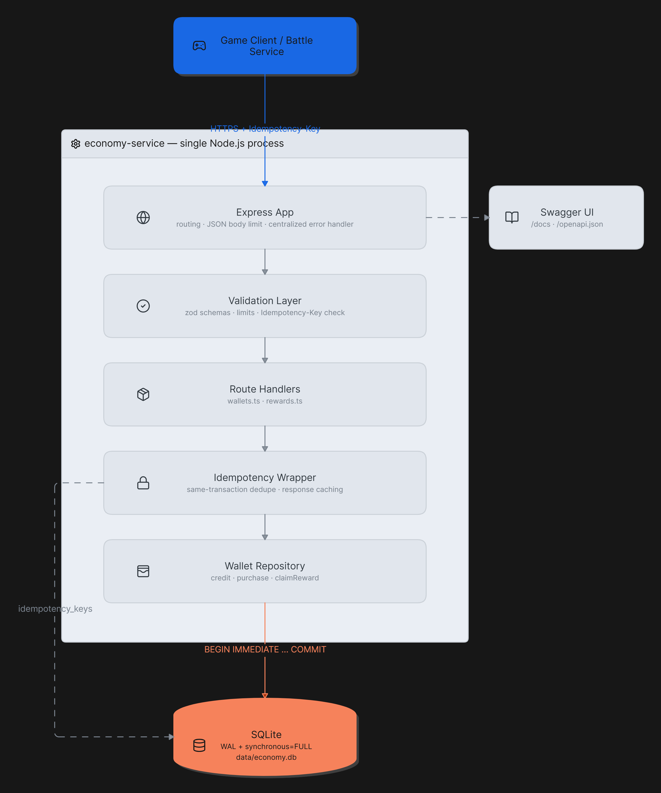
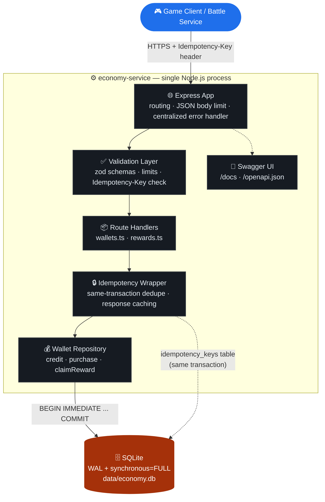

# economy-service

A durable wallet/economy backend for a game: players earn currency, spend it in a shop, and claim one-time rewards — with **exactly-once effects under retries** and **crash-safe durability**, backed by SQLite.

> 📄 **Start here:** [`DESIGN.md`](./DESIGN.md) (architecture, datastore choice, idempotency/atomicity/durability strategy, data model, API contract) · [`RESILIENCE.md`](./RESILIENCE.md) (cross-service exactly-once, incident response) · [`AI_DISCLOSURE.md`](./AI_DISCLOSURE.md) (AI-tool use disclosure)

## System design



*See [`DESIGN.md`](./DESIGN.md) §2 for the layer-by-layer breakdown, and §4/§5/§8 for the idempotency, crash-durability, and concurrency sequence diagrams.*

<details>
<summary>Mermaid version (renders inline even if the image above doesn't load)</summary>



</details>

## Requirements

- Node.js **≥ 22.5.0** (uses the built-in `node:sqlite` module) — or Docker, see below.

## Running locally

```bash
npm install         # installs dependencies into node_modules (required once,
                     # before build/dev/typecheck/test — node_modules is not
                     # committed to git, so a fresh clone always needs this first)
npm run dev          # starts the server on PORT (default 3000), DB at ./data/economy.db
```

> **`'tsc' is not recognized...` / `'tsx' is not recognized...`?** This means `npm install` hasn't been run yet (or didn't finish) in this folder — those tools live in `node_modules/.bin`, which only exists after `npm install`. Run `npm install` from the project root (the folder containing `package.json`) and re-run the command.

Other scripts:

```bash
npm run build       # compile TypeScript to dist/
npm start           # run the compiled server (dist/index.js)
npm test            # run the automated test suite (unit + concurrency + crash-durability)
npm run typecheck   # tsc --noEmit
```

## Running with Docker

No local Node.js install needed — everything (including the Node version with `node:sqlite` support) runs inside the container.

```bash
docker compose up --build
```

This builds the image, starts the service on `http://localhost:3000`, and persists `data/economy.db` in a named Docker volume (`economy-data`) so the wallet data survives `docker compose down` / container restarts — the same crash-durability guarantees described in `DESIGN.md` apply whether you run the process directly or inside this container, because durability comes from the SQLite file + WAL, not from anything Docker-specific.

Without Compose, plain Docker also works:

```bash
docker build -t economy-service .
docker run -p 3000:3000 -v economy-data:/app/data economy-service
```

Stop it with `docker compose down` (add `-v` to also delete the persisted volume/data).

Environment variables:

| Variable | Default | Purpose |
|---|---|---|
| `PORT` | `3000` | HTTP port |
| `DB_PATH` | `./data/economy.db` | SQLite file location |
| `TEST_CRASH_POINT` | unset | Test-only. Set to `after-debit-before-grant` to make the server `kill -9` itself mid-purchase, for crash-durability testing. Never set this in normal use. |

Once running:

- **Swagger UI (interactive API docs):** [http://localhost:3000/docs](http://localhost:3000/docs) — browse and try every endpoint from the browser.
- **Raw OpenAPI spec:** [http://localhost:3000/openapi.json](http://localhost:3000/openapi.json)
- **Health check:** `GET /healthz`

## Exercising the API

Every mutating request needs an `Idempotency-Key` header: any unique opaque string works (it doesn't have to be a UUID) — reuse the **same** key when retrying a request, use a **fresh** key for a genuinely new one.

### Generating an idempotency key

Pick whichever matches your shell — all three produce an equivalent random ID:

| Shell | Command |
|---|---|
| macOS / Linux (bash/zsh) | `uuidgen` |
| Windows PowerShell | `[guid]::NewGuid().ToString()` |
| Any OS with Node installed (most portable — works in cmd.exe too) | `node -e "console.log(crypto.randomUUID())"` |

### curl examples (bash / macOS / Linux)

```bash
BASE=http://localhost:3000

# Earn currency (simulated battle payout)
curl -s -X POST "$BASE/v1/wallets/player1/credit" \
  -H "Content-Type: application/json" -H "Idempotency-Key: $(uuidgen)" \
  -d '{"amount": 100, "reason": "battle_win"}'

# Spend it in the shop
curl -s -X POST "$BASE/v1/wallets/player1/purchase" \
  -H "Content-Type: application/json" -H "Idempotency-Key: $(uuidgen)" \
  -d '{"itemId": "sword", "price": 40}'

# Claim a one-time reward
curl -s -X POST "$BASE/v1/rewards/welcome-bonus/claim" \
  -H "Content-Type: application/json" -H "Idempotency-Key: $(uuidgen)" \
  -d '{"playerId": "player1"}'

# Read current state
curl -s "$BASE/v1/wallets/player1"

# Retrying the SAME request with the SAME Idempotency-Key returns the
# SAME response and applies the effect only once — try re-running the
# credit command above with the same -H "Idempotency-Key: ..." value.
```

### PowerShell examples (Windows)

`curl` in PowerShell is an alias for `Invoke-WebRequest` with different syntax, so use `curl.exe` (the real curl binary, ships with Windows 10+) to keep the same flags as above:

```powershell
$BASE = "http://localhost:3000"
$KEY = [guid]::NewGuid().ToString()

# Earn currency (simulated battle payout)
curl.exe -s -X POST "$BASE/v1/wallets/player1/credit" `
  -H "Content-Type: application/json" -H "Idempotency-Key: $KEY" `
  -d '{"amount": 100, "reason": "battle_win"}'

# Spend it in the shop
curl.exe -s -X POST "$BASE/v1/wallets/player1/purchase" `
  -H "Content-Type: application/json" -H "Idempotency-Key: $([guid]::NewGuid())" `
  -d '{"itemId": "sword", "price": 40}'

# Read current state
curl.exe -s "$BASE/v1/wallets/player1"
```

## Tests

```bash
npm test
```

Covers, among other things:

- Input validation and error-shape contract tests (`tests/api.test.ts`)
- **20 concurrent purchases against a wallet that can only afford one** — asserts exactly 1 success, 19 clean `409 insufficient_funds`, and a final balance/inventory consistent with exactly one purchase (`tests/concurrency.test.ts`)
- **Duplicate requests (same `Idempotency-Key`) fired concurrently** — asserts the effect applies exactly once and every response is identical (`tests/concurrency.test.ts`)
- **A real `kill -9` mid-purchase** against the actual compiled server process, followed by a restart against the same database file, asserting no partial effect and that a retry with the same key then succeeds cleanly exactly once (`tests/crash-durability.test.ts`)

## Documentation

- [`DESIGN.md`](./DESIGN.md) — architecture, datastore choice, idempotency strategy, atomicity/durability strategy, data model (ER diagram), API contract, and sequence diagrams for the credit/purchase/claim flows and the concurrent-purchase race.
- [`RESILIENCE.md`](./RESILIENCE.md) — what happens if the inventory grant becomes a separate, unreliable service; the outbox/saga approach to keeping a purchase exactly-once end-to-end; and how to fix a live double-credit bug without downtime.
- [`AI_DISCLOSURE.md`](./AI_DISCLOSURE.md) — disclosure of AI-tool use during development.
