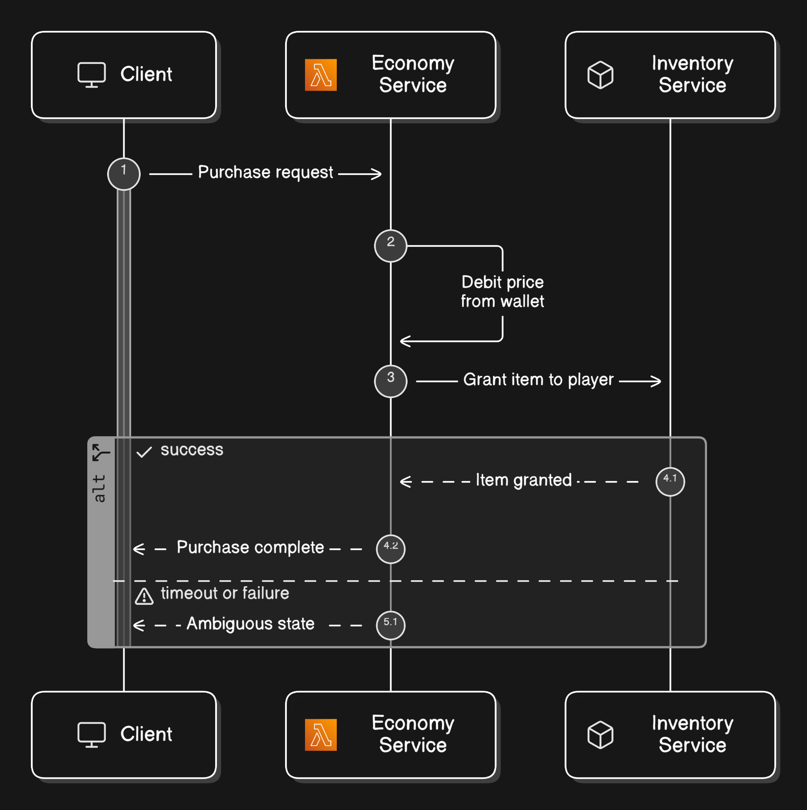
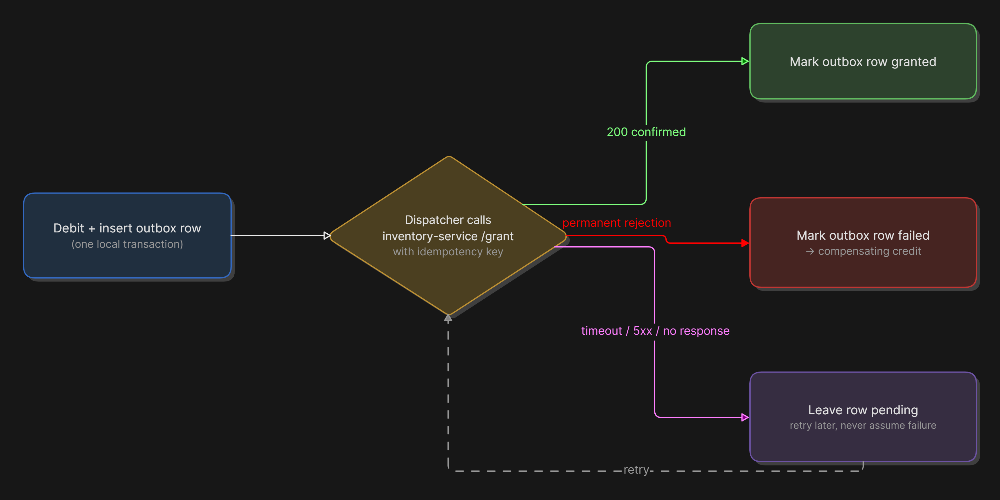
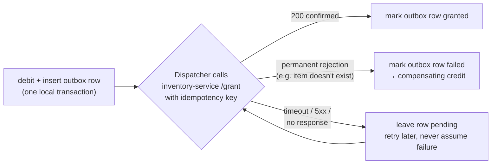

# RESILIENCE.md — Beyond a Single Transaction

`DESIGN.md` covers the current implementation, where `purchase` is safe because the debit and the grant live in **one SQLite transaction**. This document answers: what if they didn't?

## 1. Scenario: item grant moves to a separate inventory service

Assume the debit stays in our currency store, but the grant becomes a call to an external inventory service reached over HTTP — a call that can time out, fail outright, or (because the caller retries on any of those) **be processed twice** by the inventory service itself. The two stores no longer share a transaction, so we lose the "both happen or neither happens" guarantee for free.

### Where the unsafe window is



```mermaid
sequenceDiagram
    autonumber
    participant C as Client
    participant Eco as economy-service (currency store)
    participant Inv as inventory-service (external, separate store)

    C->>Eco: POST /purchase (Idempotency-Key: k)
    Eco->>Eco: BEGIN; debit price; COMMIT
    Note over Eco,Inv: PARTIAL-FAILURE WINDOW:\ndebit is committed, grant has not\nyet been confirmed.
    Eco->>Inv: POST /grant (itemId, playerId, idempotency key)
    alt inventory call succeeds
        Inv-->>Eco: 200 granted
        Eco-->>C: 200 purchase complete
    else inventory call times out / 5xx / connection dropped
        Inv--xEco: no response, or ambiguous response
        Note over Eco: We don't know if the grant happened\nor not — money is debited either way.
    end
```

The named window is: **after the currency debit commits, before we have a *confirmed* grant.** Anything that crashes, times out, or errors in that window leaves us with money taken but an unknown inventory state.

### Approach: transactional outbox + idempotent consumer, not a distributed transaction

We don't try to make the debit and the grant atomic across two systems (two-phase commit across a service boundary is fragile and usually unsupported by "someone else's API" anyway). Instead we make the *end-to-end effect* exactly-once by combining two properties:

1. **Transactional outbox on our side.** In the *same* SQLite transaction as the debit, insert an `outbox_grants` row: `(id, player_id, item_id, status: 'pending', idempotency_key, created_at)`. The debit and the "intent to grant" are now atomic with each other, because they're back in one local transaction — we've just moved the atomicity boundary to "debit + record the intent," not "debit + remote grant."
2. **A dispatcher (background worker or the request handler itself, retried) reads pending outbox rows and calls the inventory service, passing our own `idempotency_key` as the inventory service's idempotency key too** (assuming it supports one — if it doesn't, see below). On a confirmed `200`, mark the outbox row `granted`. On a confirmed permanent rejection, mark it `failed` and reverse the debit via a compensating credit (see §3, "saga" direction). On a timeout/ambiguous response, **do nothing except retry later** — never assume failure from a timeout, because the call may well have succeeded on the other side.
3. **Idempotent consumer on the inventory side is required, not optional.** If the inventory API is willing to accept an idempotency key, we already win: our retries collapse to one grant. If it is *not* idempotent, we cannot make this exactly-once from the caller side alone — we'd instead need to poll a `GET /inventory/:playerId` style endpoint to check "did the grant already land" before retrying blindly, or accept **at-least-once grants with an application-level reconciliation job** that detects and removes duplicate grants after the fact. The honest answer is: end-to-end exactly-once across a boundary you don't control is only as strong as the weakest idempotency guarantee either side offers — our job is to make *our* side idempotent and retry safely, and to flag (rather than silently trust) an inventory API that gives us none of that.





This is the **outbox pattern** feeding a **saga** with one compensation step (refund on permanent failure). We never hold a lock across the network call, and a crash at any point just leaves an outbox row in `pending` — which is safe to retry, because the retry is itself deduplicated by the idempotency key we send downstream.

## 2. Sub-question: a bug double-granted currency to some players last week — fix without downtime

Constraints: production is live, we cannot take it offline, and we cannot simply "delete the extra money" without understanding who is affected and without a client mid-purchase getting caught in an inconsistent state.

Approach, in order:

1. **Detect and quantify first, mutate second.** Because every credit already carries a `reason` and, going forward, should carry a `source_event_id` (the battle/event that caused it), the least risky first move is a *read-only* audit query: find all `credit` idempotency-key rows (or, if the bug predates idempotency keys, correlate by `reason` + timestamp clustering) that map to the same underlying game event but were applied more than once. This produces an exact list of `(player_id, duplicate_amount)` — no code change required yet, and it can run against a replica so it adds zero load/risk to the live path.
2. **Stop the bleeding without a deploy freeze.** If the bug is still live, it's almost certainly a missing or too-narrow idempotency key on the credit call site (e.g. the caller wasn't sending one, or was generating a new one per retry instead of reusing it). That's a forward-fix: ship the corrected call site behind a normal deploy — this repo's idempotency mechanism already makes *newly* correct calls safe; no schema migration needed for the fix itself.
3. **Reverse the effect with a *new*, auditable transaction — never edit the wallet balance directly.** For each affected player, issue a **compensating debit** (`amount = -duplicate_amount` conceptually; in this schema, a signed adjustment through the same `runInTransaction` path used by `creditWallet`, or a dedicated `adjustWallet(playerId, delta, reason: "correction:<audit-id>")` helper) rather than an `UPDATE wallets SET balance = balance - X` run by hand. Going through the normal transactional path keeps the fix consistent with every other invariant in the system (can't go negative, is atomic, is logged) instead of being a one-off script that bypasses them.
4. **Never let a correction push a balance negative or into a state the player couldn't have reached honestly.** If a player already spent the duplicated currency, a naive debit would take their balance negative, which violates the core invariant. Policy choice (documented, not silently decided by the script): debit down to zero and record the shortfall as a separate `outstanding_correction` amount rather than allowing a negative balance — this keeps `balance >= 0` true everywhere in the system, and the shortfall becomes a product/support decision (e.g. "clawed back from future earnings" or "written off") rather than a data-integrity violation.
5. **Roll out gradually and reversibly.** Run the correction as a batch job with a small concurrency limit, one `Idempotency-Key` per affected player per run (so if the job is itself interrupted and restarted, it can't double-correct), and a dry-run mode that logs intended deltas before writing any of them. Ship it as its own auditable event so "why did my balance change" is always answerable from the same ledger-style data used everywhere else — no silent manual balance edits.
6. **Add the regression test.** Once root-caused, add the concrete failing case (duplicate credit for the same underlying event) to the automated test suite so this exact bug class can't reappear silently.

The throughline: detect before mutating, fix forward through the same transactional path everything else uses, never touch a balance outside of an accounted-for transaction, and make the correction itself replayable/idempotent — because "the fix for a duplication bug accidentally double-applying" would be a worse headline than the original bug.
